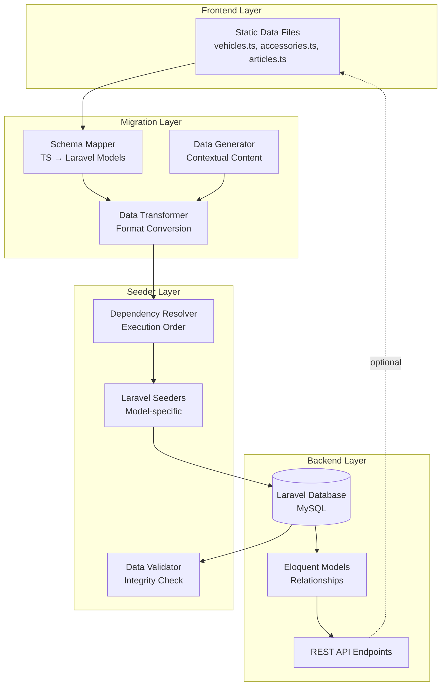

# Design Document: Data Filling Plan

## Overview

The Data Filling Plan system provides a structured approach to migrate static frontend data from Next.js TypeScript files into the Laravel backend database through automated seeders. The system ensures data integrity through dependency-aware seeding, maintains contextual relevance for Ford Đồng Nai business domain, and supports multi-language content.

### Goals

- Migrate frontend static data (vehicles, accessories, articles) to backend database
- Establish clear schema mapping between TypeScript interfaces and Laravel models
- Create dependency-ordered seeders to prevent foreign key constraint violations
- Generate contextual Vietnamese automotive industry data
- Support both Vietnamese and English localizations
- Provide validation and integrity checking post-migration

### Non-Goals

- Real-time data synchronization between frontend and backend
- Automated frontend code refactoring to use API calls
- Production data migration (focus is on demo/seed data)
- Data transformation beyond basic type conversions

## Architecture

### System Components



### High-Level Architecture Flow

1. **Analysis Phase**: Schema Mapper analyzes TypeScript interfaces and maps them to Laravel Eloquent models
2. **Transformation Phase**: Data Transformer converts TypeScript data structures to Laravel-compatible formats (arrays, JSON)
3. **Generation Phase**: Data Generator creates additional contextual content (Vietnamese names, addresses, automotive terms)
4. **Resolution Phase**: Dependency Resolver determines correct seeding order based on foreign key relationships
5. **Seeding Phase**: Laravel Seeders populate database tables in dependency order
6. **Validation Phase**: Data Validator checks referential integrity and completeness

## Components and Interfaces

### 1. Schema Mapper

**Purpose**: Maps TypeScript interfaces to Laravel Eloquent models and database tables.

**Interface**:
```typescript
interface SchemaMapping {
  frontendInterface: string;      // e.g., "Vehicle"
  backendModel: string;            // e.g., "App\Models\Vehicle\Vehicle"
  tableName: string;               // e.g., "vehicles"
  fieldMappings: FieldMapping[];
  relationships: RelationshipMapping[];
}

interface FieldMapping {
  tsField: string;                 // e.g., "basePrice"
  dbColumn: string;                // e.g., "base_price"
  dataType: string;                // e.g., "decimal", "json", "string"
  transformation?: string;         // e.g., "parseJSON", "convertToDecimal"
  isTranslatable: boolean;
}
```

**Key Mappings**:

- **Vehicle (TS) → Vehicle (Laravel)**
  - `id` → `id` (auto-increment, skip in seeder)
  - `name` → `vehicle_translations.title`
  - `type` → `type` (enum: suv, pickup, commercial)
  - `basePrice` → `base_price` (decimal)
  - `images[]` → `images` (JSON array)
  - `colors[]` → `colors` (JSON array)
  - `versions[]` → Separate `vehicle_versions` table (HasMany relationship)

- **AccessoryItem (TS) → Product (Laravel)**
  - `id` → `id`
  - `name` → `product_translations.title`
  - `code` → `sku`
  - `category` → `product_categories` (BelongsToMany via `product_ref_categories`)
  - `price` → `price` (decimal)
  - `images[]` → `images` (JSON array)
  - `fitVehicles[]` → custom JSON field or related table

- **Article (TS) → Post (Laravel)**
  - `id` → `id`
  - `title` → `post_translations.title`
  - `category` → `post_categories` (BelongsToMany via `post_ref_categories`)
  - `date` → `published_at` (datetime)
  - `content` → `post_translations.description`
  - `body[]` → `post_translations.content` (transform to HTML/richtext)

### 2. Data Transformer

**Purpose**: Converts TypeScript data structures into Laravel-compatible formats.

**Key Transformations**:


1. **Array to JSON**:
   ```php
   // TypeScript: images: string[]
   // Laravel: images column (TEXT) storing JSON
   $vehicle->images = json_encode([
       ['path' => '/assets/car-everest.png', 'alt' => 'Ford Everest']
   ]);
   ```

2. **Nested Objects to Separate Tables**:
   ```php
   // TypeScript: versions: Version[]
   // Laravel: VehicleVersion model with vehicle_id foreign key
   foreach ($tsVehicle['versions'] as $version) {
       VehicleVersion::create([
           'vehicle_id' => $vehicle->id,
           'price' => $version['price'],
           'specs' => json_encode($version['specs'])
       ]);
   }
   ```

3. **Translatable Fields**:
   ```php
   // Create parent record
   $vehicle = Vehicle::create(['type' => 'suv', 'base_price' => 1099000000]);
   
   // Create translations
   VehicleTranslation::create([
       'vehicle_id' => $vehicle->id,
       'locale' => 'vi',
       'title' => 'NEW EVEREST',
       'slug' => 'new-everest',
       'tagline' => 'Dấn bước. Dẫn đầu.',
       'description' => '...'
   ]);
   ```

4. **Content Block Transformation**:
   ```php
   // TypeScript: body: ArticleContentBlock[]
   // Transform to HTML richtext format
   $htmlContent = '';
   foreach ($article['body'] as $block) {
       if ($block['type'] === 'paragraph') {
           $htmlContent .= "<p>{$block['value']}</p>";
       } elseif ($block['type'] === 'heading') {
           $htmlContent .= "<h2>{$block['value']}</h2>";
       } elseif ($block['type'] === 'list') {
           $htmlContent .= '<ul>';
           foreach ($block['value'] as $item) {
               $htmlContent .= "<li>{$item}</li>";
           }
           $htmlContent .= '</ul>';
       } elseif ($block['type'] === 'image') {
           $htmlContent .= "";
       }
   }
   ```

### 3. Data Generator

**Purpose**: Generate additional contextual demo data for entities not present in frontend static files.

**Generation Rules**:

- **Vietnamese Names**: Use common Vietnamese names for customers, reviews, consultants
- **Addresses**: Generate addresses in Đồng Nai province (Biên Hòa, Long Thành, Nhơn Trạch)
- **Phone Numbers**: Format +84 or 0xxx xxx xxx (10 digits)
- **Automotive Terms**: Use proper Vietnamese automotive terminology
- **Realistic Prices**: Generate prices within market ranges for Vietnamese automotive industry
- **Dates**: Generate dates within last 6 months for posts, orders

**Example**:
```php
class DemoDataGenerator {
    public function generateSalesConsultant(): array {
        return [
            'name' => Arr::random(['Nguyễn Văn An', 'Trần Thị Bình', 'Lê Minh Cường']),
            'phone' => '0' . rand(900000000, 999999999),
            'email' => Str::random(8) . '@dongnaiford.vn',
            'avatar' => '/avatars/' . rand(1, 20) . '.jpg',
            'position' => 'Chuyên viên tư vấn bán hàng'
        ];
    }
}
```


### 4. Dependency Resolver

**Purpose**: Determines correct seeding execution order based on foreign key relationships.

**Dependency Graph**:

```mermaid
graph TD
    Settings[Settings]
    Translations[Translations]
    Regions[Regions]
    
    Users[Users/Admins]
    Roles[Roles]
    
    VehicleCategories[Vehicle Categories]
    Vehicles[Vehicles]
    VehicleVersions[Vehicle Versions]
    RegistrationFees[Registration Fees]
    
    ProductCategories[Product Categories]
    Brands[Brands]
    Products[Products]
    ProductRefCategories[Product Ref Categories]
    Inventories[Inventories]
    
    PostCategories[Post Categories]
    Tags[Tags]
    Posts[Posts]
    PostRefCategories[Post Ref Categories]
    PostRefTags[Post Ref Tags]
    
    Services[Services]
    ServiceTranslations[Service Translations]
    
    Histories[Histories]
    HistoryTranslations[History Translations]
    
    Agencies[Agencies]
    AgencyTranslations[Agency Translations]
    
    Sliders[Sliders]
    SliderTranslations[Slider Translations]
    
    Banners[Banners]
    CustomerReviews[Customer Reviews]
    SalesConsultants[Sales Consultants]
    Partners[Partners]
    Awards[Awards]
    
    MetaPages[Meta Pages]
    Policies[Policies]
    
    Settings --> Users
    Roles --> Users
    
    VehicleCategories --> Vehicles
    Vehicles --> VehicleVersions
    Vehicles --> RegistrationFees
    Vehicles --> CustomerReviews
    
    ProductCategories --> Products
    Brands --> Products
    Products --> ProductRefCategories
    Products --> Inventories
    
    PostCategories --> Posts
    Tags --> Posts
    Posts --> PostRefCategories
    Posts --> PostRefTags
    
    Services --> ServiceTranslations
    Histories --> HistoryTranslations
    Agencies --> AgencyTranslations
    Sliders --> SliderTranslations
```



**Execution Order** (Level-by-level):

**Level 0** (Independent tables):
- Settings
- Translations
- Regions
- Roles

**Level 1** (Depends on Level 0):
- Users
- Admins
- VehicleCategories
- ProductCategories
- Brands
- PostCategories
- Tags

**Level 2** (Depends on Level 1):
- Vehicles
- Products
- Posts
- Services
- Histories
- Agencies
- Sliders
- Banners
- Partners
- Awards
- SalesConsultants
- Policies

**Level 3** (Depends on Level 2):
- VehicleVersions
- VehicleTranslations
- RegistrationFees
- CustomerReviews
- ProductTranslations
- ProductRefCategories
- Inventories
- PostTranslations
- PostRefCategories
- PostRefTags
- ServiceTranslations
- HistoryTranslations
- AgencyTranslations
- SliderTranslations

**Level 4** (Depends on Level 3):
- MetaPages
- PolicyTranslations
- RelatedProducts
- RelatedPosts

### 5. Laravel Seeders

**Seeder Architecture**:

```php
// DatabaseSeeder.php (master seeder)
class DatabaseSeeder extends Seeder {
    public function run() {
        // Level 0
        $this->call([
            SettingsSeeder::class,
            TranslationsSeeder::class,
            RegionsSeeder::class,
            RolesSeeder::class,
        ]);
        
        // Level 1
        $this->call([
            UsersSeeder::class,
            VehicleCategoriesSeeder::class,
            ProductCategoriesSeeder::class,
            BrandsSeeder::class,
            PostCategoriesSeeder::class,
            TagsSeeder::class,
        ]);
        
        // Level 2
        $this->call([
            VehiclesSeeder::class,
            ProductsSeeder::class,
            PostsSeeder::class,
            ServicesSeeder::class,
            HistoriesSeeder::class,
            AgenciesSeeder::class,
            SlidersSeeder::class,
            BannersSeeder::class,
            PartnersSeeder::class,
            AwardsSeeder::class,
            SalesConsultantsSeeder::class,
            PoliciesSeeder::class,
        ]);
        
        // Level 3
        $this->call([
            VehicleVersionsSeeder::class,
            RegistrationFeesSeeder::class,
            CustomerReviewsSeeder::class,
            ProductRefCategoriesSeeder::class,
            InventoriesSeeder::class,
            PostRefCategoriesSeeder::class,
            PostRefTagsSeeder::class,
        ]);
        
        // Level 4
        $this->call([
            MetaPagesSeeder::class,
            RelatedProductsSeeder::class,
            RelatedPostsSeeder::class,
        ]);
    }
}
```

**Example Vehicle Seeder**:

```php
class VehiclesSeeder extends Seeder {
    public function run() {
        $suvCategory = VehicleCategory::where('slug', 'suv')->first();
        
        // From frontend static data
        $vehicle = Vehicle::create([
            'category_id' => $suvCategory->id,
            'type' => 'suv',
            'is_best_seller' => true,
            'base_price' => 1099000000,
            'images' => json_encode([
                ['path' => '/assets/car-everest.png', 'alt' => 'Ford Everest']
            ]),
            'colors' => json_encode([
                ['name' => 'Đỏ Cam', 'hex' => '#c2410c', 'image' => 'orange'],
                ['name' => 'Xám Falcon', 'hex' => '#4b5563', 'image' => 'gray']
            ]),
            'status' => 'ACTIVE',
            'sort_order' => 1
        ]);
        
        // Create translations
        VehicleTranslation::create([
            'vehicle_id' => $vehicle->id,
            'locale' => 'vi',
            'title' => 'NEW EVEREST',
            'slug' => 'new-everest',
            'tagline' => 'Dấn bước. Dẫn đầu.',
            'description' => 'Được thiết kế để chinh phục mọi thử thách...',
            'seo_meta_title' => 'Ford Everest 2026 - SUV 7 Chỗ Cao Cấp',
            'seo_slug' => 'ford-everest-2026',
        ]);
        
        VehicleTranslation::create([
            'vehicle_id' => $vehicle->id,
            'locale' => 'en',
            'title' => 'NEW EVEREST',
            'slug' => 'new-everest-en',
            'tagline' => 'Step Forward. Lead the Way.',
            'description' => 'Designed to conquer every challenge...',
        ]);
    }
}
```

### 6. Data Validator

**Purpose**: Validate data integrity and completeness after seeding.

**Validation Checks**:

1. **Foreign Key Integrity**:
   ```php
   // Check all vehicle_versions reference valid vehicles
   $orphanedVersions = VehicleVersion::whereNotIn('vehicle_id', 
       Vehicle::pluck('id')
   )->count();
   ```

2. **Translation Completeness**:
   ```php
   // Check all vehicles have vi and en translations
   $vehiclesWithoutViTranslation = Vehicle::whereDoesntHave('translations', function($q) {
       $q->where('locale', 'vi');
   })->count();
   ```

3. **Required Data Presence**:
   ```php
   // Check minimum data for each page
   $checks = [
       'Home Page - Featured Vehicles' => Vehicle::where('is_best_seller', true)->count() >= 3,
       'Home Page - Banners' => Banner::count() >= 5,
       'Products Page - Vehicles' => Vehicle::count() >= 8,
       'Accessories Page - Products' => Product::count() >= 20,
       'News Page - Posts' => Post::count() >= 15,
   ];
   ```

4. **JSON Field Validation**:
   ```php
   // Validate JSON fields are properly formatted
   foreach (Vehicle::all() as $vehicle) {
       $images = json_decode($vehicle->images, true);
       if (json_last_error() !== JSON_ERROR_NONE) {
           $errors[] = "Vehicle {$vehicle->id} has invalid images JSON";
       }
   }
   ```

**Validation Report Format**:

```json
{
  "timestamp": "2026-05-20T10:30:00Z",
  "status": "passed",
  "checks": {
    "foreign_key_integrity": { "status": "passed", "errors": [] },
    "translation_completeness": { "status": "passed", "missing_vi": 0, "missing_en": 0 },
    "page_data_requirements": {
      "home_page": { "featured_vehicles": 4, "banners": 8, "status": "passed" },
      "products_page": { "vehicles": 12, "status": "passed" }
    },
    "json_validation": { "status": "passed", "errors": [] }
  },
  "summary": {
    "total_records": 1247,
    "tables_seeded": 42,
    "errors": 0,
    "warnings": 0
  }
}
```

## Data Models

### Database Schema Mapping

#### Vehicles Domain

**vehicles table**:
```sql
id (PK)
category_id (FK → vehicle_categories.id)
type (ENUM: 'suv', 'pickup', 'commercial')
is_best_seller (BOOLEAN)
base_price (DECIMAL)
image (JSON)
images (JSON)
colors (JSON)
images_360_external (JSON)
image_360_internal_url (VARCHAR)
status (ENUM: 'ACTIVE', 'INACTIVE')
sort_order (INT)
created_at, updated_at, deleted_at
```

**vehicle_translations table**:
```sql
id (PK)
vehicle_id (FK → vehicles.id)
locale (VARCHAR: 'vi', 'en')
title (VARCHAR)
slug (VARCHAR)
tagline (TEXT)
description (TEXT)
seo_meta_title, seo_slug, seo_meta_description, etc.
```

**vehicle_versions table**:
```sql
id (PK)
vehicle_id (FK → vehicles.id)
price (DECIMAL)
specs (JSON)
status (ENUM)
sort_order (INT)
```

**vehicle_version_translations table**:
```sql
id (PK)
vehicle_version_id (FK → vehicle_versions.id)
locale (VARCHAR)
name (VARCHAR)
```

#### Products/Accessories Domain

**products table**:
```sql
id (PK)
brand_id (FK → brands.id)
sku (VARCHAR)
price (DECIMAL)
old_price, sale_price (DECIMAL)
stock_quantity (INT)
images (JSON)
is_featured (BOOLEAN)
status (ENUM)
```

**product_translations table**:
```sql
id (PK)
product_id (FK → products.id)
locale (VARCHAR)
title, slug (VARCHAR)
description, content (TEXT)
seo_meta_title, seo_slug, etc.
```

**product_ref_categories table** (many-to-many pivot):
```sql
id (PK)
product_id (FK → products.id)
product_category_id (FK → product_categories.id)
```

**inventories table**:
```sql
id (PK)
product_id (FK → products.id)
quantity (INT)
stock_status (VARCHAR)
```

#### Posts/News Domain

**posts table**:
```sql
id (PK)
type (ENUM: 'POST', 'SERVICE', 'FEEDBACK')
status (ENUM)
published_at (DATETIME)
is_featured (BOOLEAN)
image, banner (JSON)
view_count (INT)
```

**post_translations table**:
```sql
id (PK)
post_id (FK → posts.id)
locale (VARCHAR)
title, slug (VARCHAR)
description (TEXT)
content (LONGTEXT)
author (VARCHAR)
```

**post_ref_categories table** (many-to-many pivot):
```sql
id (PK)
post_id (FK → posts.id)
post_category_id (FK → post_categories.id)
```

**post_ref_tags table** (many-to-many pivot):
```sql
id (PK)
post_id (FK → posts.id)
tag_id (FK → tags.id)
```

#### Supporting Tables

**vehicle_categories, product_categories, post_categories**:
```sql
id (PK)
parent_id (FK → self, nullable)
status (ENUM)
sort_order (INT)
```


**brands table**:
```sql
id (PK)
status (ENUM)
```

**brand_translations table**:
```sql
id (PK)
brand_id (FK)
locale (VARCHAR)
name (VARCHAR)
```

**services table**:
```sql
id (PK)
image, benefit_image (JSON)
sliders (JSON)
email (VARCHAR)
status (ENUM)
```

**service_translations table**:
```sql
id (PK)
service_id (FK)
locale (VARCHAR)
title, slug (VARCHAR)
description (TEXT)
```

**settings table** (key-value configuration):
```sql
id (PK)
key (VARCHAR)
value (TEXT)
```

**meta_pages table** (SEO metadata for static pages):
```sql
id (PK)
page_name (VARCHAR)
meta_title, meta_description (TEXT)
og_image (VARCHAR)
```

## Error Handling

### Seeder Error Handling Strategy

**1. Transactional Seeding**:
```php
DB::transaction(function () {
    $this->call([
        VehiclesSeeder::class,
        VehicleVersionsSeeder::class,
    ]);
});
```

**2. Foreign Key Constraint Errors**:
- **Detection**: Catch `QueryException` with error code 1452 (Cannot add or update a child row)
- **Resolution**: 
  - Verify parent record exists before creating child
  - Log missing parent IDs
  - Skip child record or create placeholder parent
  
```php
try {
    VehicleVersion::create([
        'vehicle_id' => $vehicleId,
        ...
    ]);
} catch (\Illuminate\Database\QueryException $e) {
    if ($e->getCode() === '23000') { // FK constraint violation
        Log::error("FK violation: vehicle_id {$vehicleId} not found");
        // Skip or handle gracefully
    }
}
```

**3. JSON Encoding Errors**:
```php
$images = json_encode($imagesArray);
if (json_last_error() !== JSON_ERROR_NONE) {
    Log::error("JSON encoding error: " . json_last_error_msg());
    $images = json_encode([]); // Fallback to empty array
}
```

**4. Duplicate Slug Errors**:
```php
// Generate unique slug if collision detected
$slug = Str::slug($title);
$counter = 1;
while (VehicleTranslation::where('slug', $slug)->exists()) {
    $slug = Str::slug($title) . '-' . $counter;
    $counter++;
}
```

**5. Missing Translation Errors**:
```php
// Always create at least Vietnamese translation
if (!isset($translations['vi'])) {
    throw new \Exception("Vietnamese translation is required");
}

// Create English translation with fallback
$translations['en'] = $translations['en'] ?? [
    'title' => $translations['vi']['title'] . ' (EN)',
    'description' => 'Translation pending'
];
```

**6. Rollback Strategy**:
```php
// In DatabaseSeeder
public function run() {
    DB::beginTransaction();
    
    try {
        $this->call([...seeders...]);
        DB::commit();
        $this->command->info('✓ All seeders completed successfully');
    } catch (\Exception $e) {
        DB::rollBack();
        $this->command->error('✗ Seeding failed: ' . $e->getMessage());
        Log::error('Seeding rollback', ['error' => $e->getMessage(), 'trace' => $e->getTraceAsString()]);
        throw $e;
    }
}
```

### Validation Error Handling

**Missing Data Warnings**:
```php
$warnings = [];
if (Vehicle::count() < 8) {
    $warnings[] = "Only " . Vehicle::count() . " vehicles seeded (expected ≥8)";
}
```

**Integrity Violations**:
```php
$orphans = VehicleVersion::whereDoesntHave('vehicle')->get();
if ($orphans->count() > 0) {
    throw new \Exception("Found {$orphans->count()} orphaned vehicle versions");
}
```


## Testing Strategy

### Testing Approach

The Data Filling Plan system does not involve property-based testing as it primarily deals with **data migration and seeding**, which is a one-time configuration and setup task rather than algorithmic logic with universal properties.

Testing will focus on:

1. **Unit Tests** for data transformation functions
2. **Integration Tests** for seeder execution
3. **Validation Tests** for data integrity
4. **Smoke Tests** for database constraints

### Unit Tests

**Data Transformer Tests**:
```php
class DataTransformerTest extends TestCase {
    /** @test */
    public function it_transforms_typescript_vehicle_to_laravel_model() {
        $tsVehicle = [
            'name' => 'NEW EVEREST',
            'basePrice' => 1099000000,
            'type' => 'suv'
        ];
        
        $transformed = DataTransformer::transformVehicle($tsVehicle);
        
        $this->assertEquals('NEW EVEREST', $transformed['translations']['vi']['title']);
        $this->assertEquals(1099000000, $transformed['base_price']);
        $this->assertEquals('suv', $transformed['type']);
    }
    
    /** @test */
    public function it_converts_article_content_blocks_to_html() {
        $blocks = [
            ['type' => 'paragraph', 'value' => 'Test paragraph'],
            ['type' => 'heading', 'value' => 'Test heading']
        ];
        
        $html = DataTransformer::contentBlocksToHtml($blocks);
        
        $this->assertStringContainsString('<p>Test paragraph</p>', $html);
        $this->assertStringContainsString('<h2>Test heading</h2>', $html);
    }
}
```

**Data Generator Tests**:
```php
class DemoDataGeneratorTest extends TestCase {
    /** @test */
    public function it_generates_valid_vietnamese_phone_number() {
        $phone = DemoDataGenerator::generatePhoneNumber();
        
        $this->assertMatchesRegularExpression('/^0\d{9}$/', $phone);
    }
    
    /** @test */
    public function it_generates_address_in_dong_nai_province() {
        $address = DemoDataGenerator::generateAddress();
        
        $this->assertStringContainsString('Đồng Nai', $address);
    }
}
```


### Integration Tests

**Seeder Execution Tests**:
```php
class VehicleSeederTest extends TestCase {
    use RefreshDatabase;
    
    /** @test */
    public function it_seeds_vehicles_with_categories() {
        $this->seed([
            VehicleCategoriesSeeder::class,
            VehiclesSeeder::class
        ]);
        
        $this->assertDatabaseCount('vehicles', 12);
        $this->assertDatabaseHas('vehicles', [
            'type' => 'suv',
            'is_best_seller' => true
        ]);
        
        $vehicle = Vehicle::first();
        $this->assertNotNull($vehicle->category);
        $this->assertEquals('ACTIVE', $vehicle->status);
    }
    
    /** @test */
    public function it_seeds_vehicle_translations_for_both_locales() {
        $this->seed([VehicleCategoriesSeeder::class, VehiclesSeeder::class]);
        
        $vehicle = Vehicle::first();
        
        $this->assertDatabaseHas('vehicle_translations', [
            'vehicle_id' => $vehicle->id,
            'locale' => 'vi'
        ]);
        
        $this->assertDatabaseHas('vehicle_translations', [
            'vehicle_id' => $vehicle->id,
            'locale' => 'en'
        ]);
    }
    
    /** @test */
    public function it_maintains_foreign_key_integrity() {
        $this->seed([
            VehicleCategoriesSeeder::class,
            VehiclesSeeder::class,
            VehicleVersionsSeeder::class
        ]);
        
        $orphanedVersions = VehicleVersion::whereNotIn('vehicle_id', 
            Vehicle::pluck('id')
        )->count();
        
        $this->assertEquals(0, $orphanedVersions);
    }
}
```

**Dependency Order Tests**:
```php
class SeederDependencyTest extends TestCase {
    use RefreshDatabase;
    
    /** @test */
    public function it_fails_when_seeding_child_before_parent() {
        $this->expectException(QueryException::class);
        
        // Should fail because VehicleCategories not seeded yet
        $this->seed(VehiclesSeeder::class);
    }
    
    /** @test */
    public function it_succeeds_when_seeding_in_correct_order() {
        $this->seed([
            VehicleCategoriesSeeder::class,
            VehiclesSeeder::class
        ]);
        
        $this->assertDatabaseCount('vehicles', 12);
    }
}
```

### Validation Tests

**Data Completeness Tests**:
```php
class DataCompletenessTest extends TestCase {
    use RefreshDatabase;
    
    protected function setUp(): void {
        parent::setUp();
        $this->seed(DatabaseSeeder::class);
    }
    
    /** @test */
    public function home_page_has_sufficient_data() {
        $this->assertGreaterThanOrEqual(3, Vehicle::where('is_best_seller', true)->count());
        $this->assertGreaterThanOrEqual(5, Banner::count());
        $this->assertGreaterThanOrEqual(4, CustomerReview::count());
    }
    
    /** @test */
    public function products_page_has_sufficient_vehicles() {
        $this->assertGreaterThanOrEqual(8, Vehicle::count());
        $this->assertGreaterThanOrEqual(3, VehicleCategory::count());
    }
    
    /** @test */
    public function accessories_page_has_sufficient_products() {
        $this->assertGreaterThanOrEqual(20, Product::count());
        $this->assertGreaterThanOrEqual(4, ProductCategory::count());
    }
    
    /** @test */
    public function news_page_has_sufficient_posts() {
        $this->assertGreaterThanOrEqual(15, Post::count());
        $this->assertGreaterThanOrEqual(4, PostCategory::count());
    }
}
```

**Translation Completeness Tests**:
```php
class TranslationCompletenessTest extends TestCase {
    use RefreshDatabase;
    
    protected function setUp(): void {
        parent::setUp();
        $this->seed(DatabaseSeeder::class);
    }
    
    /** @test */
    public function all_vehicles_have_vietnamese_translations() {
        $vehiclesWithoutVi = Vehicle::whereDoesntHave('translations', function($q) {
            $q->where('locale', 'vi');
        })->count();
        
        $this->assertEquals(0, $vehiclesWithoutVi);
    }
    
    /** @test */
    public function all_products_have_both_locale_translations() {
        $products = Product::all();
        
        foreach ($products as $product) {
            $this->assertTrue($product->translations->contains('locale', 'vi'));
            $this->assertTrue($product->translations->contains('locale', 'en'));
        }
    }
}
```

**JSON Validation Tests**:
```php
class JsonFieldValidationTest extends TestCase {
    use RefreshDatabase;
    
    protected function setUp(): void {
        parent::setUp();
        $this->seed(DatabaseSeeder::class);
    }
    
    /** @test */
    public function vehicle_images_are_valid_json() {
        $vehicles = Vehicle::all();
        
        foreach ($vehicles as $vehicle) {
            $images = json_decode($vehicle->images, true);
            $this->assertNotNull($images);
            $this->assertIsArray($images);
        }
    }
    
    /** @test */
    public function vehicle_colors_are_valid_json() {
        $vehicles = Vehicle::all();
        
        foreach ($vehicles as $vehicle) {
            $colors = json_decode($vehicle->colors, true);
            $this->assertNotNull($colors);
            $this->assertIsArray($colors);
            
            foreach ($colors as $color) {
                $this->assertArrayHasKey('name', $color);
                $this->assertArrayHasKey('hex', $color);
            }
        }
    }
}
```

### Smoke Tests

**Database Constraint Tests**:
```php
class DatabaseConstraintTest extends TestCase {
    use RefreshDatabase;
    
    /** @test */
    public function foreign_key_constraints_are_enabled() {
        DB::statement('SET FOREIGN_KEY_CHECKS=0');
        // Attempt to insert invalid FK
        $this->expectException(QueryException::class);
        
        Vehicle::create([
            'category_id' => 99999, // Non-existent
            'type' => 'suv'
        ]);
    }
}
```

### Manual Testing Checklist

After running seeders, manually verify:


- [ ] Home page displays featured vehicles
- [ ] Home page shows banner sliders
- [ ] Products page lists all vehicle categories
- [ ] Product detail page shows vehicle versions and specs
- [ ] Accessories page displays product categories and items
- [ ] News page shows posts with correct categories
- [ ] Post detail page renders content correctly (HTML from content blocks)
- [ ] Services page displays all services
- [ ] Contact page shows agencies with addresses
- [ ] All pages have proper SEO metadata
- [ ] Language switcher works (vi ↔ en)
- [ ] Images display correctly (paths are valid)

### Test Execution Commands

```bash
# Run all tests
php artisan test

# Run specific test suite
php artisan test --testsuite=Feature

# Run seeder tests
php artisan test --filter=SeederTest

# Run validation tests
php artisan test --filter=ValidationTest

# Run with coverage
php artisan test --coverage

# Fresh seed and validate
php artisan migrate:fresh --seed
php artisan db:validate-data
```

## Implementation Notes

### Performance Considerations

1. **Batch Inserts**: Use `DB::table()->insert()` for bulk inserts instead of Eloquent `create()` when seeding large datasets
   ```php
   DB::table('vehicles')->insert($vehiclesArray);
   ```

2. **Disable Query Logging**: Prevent memory issues during large seeds
   ```php
   DB::connection()->disableQueryLog();
   ```

3. **Chunked Processing**: Process large datasets in chunks
   ```php
   foreach (array_chunk($products, 100) as $chunk) {
       Product::insert($chunk);
   }
   ```

### Image Asset Management

**Storage Structure**:
```
storage/
  app/
    public/
      vehicles/
        everest-1.jpg
        ranger-1.jpg
      products/
        accessory-1.jpg
      posts/
        article-1.jpg
      banners/
        banner-1.jpg
```

**Seeder Image References**:
```php
// Use relative paths from storage/app/public
$vehicle->image = json_encode([
    'path' => 'vehicles/everest-1.jpg',
    'alt' => 'Ford Everest'
]);
```

**Storage Link**:
```bash
php artisan storage:link
# Creates symlink: public/storage -> storage/app/public
```


### Multi-Language Strategy

**Translation Pattern**:
```php
// 1. Create parent model (non-translatable fields)
$vehicle = Vehicle::create([
    'type' => 'suv',
    'base_price' => 1099000000,
    'status' => 'ACTIVE'
]);

// 2. Create Vietnamese translation (required)
VehicleTranslation::create([
    'vehicle_id' => $vehicle->id,
    'locale' => 'vi',
    'title' => 'NEW EVEREST',
    'slug' => 'new-everest',
    'description' => '...'
]);

// 3. Create English translation (fallback if not provided)
VehicleTranslation::create([
    'vehicle_id' => $vehicle->id,
    'locale' => 'en',
    'title' => 'NEW EVEREST',
    'slug' => 'new-everest-en',
    'description' => 'English description...'
]);
```

**Slug Uniqueness**: Ensure slugs are unique per locale
```php
$slug = Str::slug($title);
$counter = 1;
while (VehicleTranslation::where('locale', $locale)
                         ->where('slug', $slug)
                         ->exists()) {
    $slug = Str::slug($title) . '-' . $counter;
    $counter++;
}
```

### SEO Metadata Strategy

**Meta Pages for Static Routes**:
```php
MetaPage::create([
    'page_name' => 'home',
    'meta_title' => 'Ford Đồng Nai - Đại Lý Chính Hãng Ford',
    'meta_description' => 'Đại lý Ford Đồng Nai chính hãng...',
    'og_image' => 'seo/home-og.jpg'
]);

MetaPage::create([
    'page_name' => 'products',
    'meta_title' => 'Xe Ford - Bảng Giá & Khuyến Mãi',
    'meta_description' => 'Xem bảng giá xe Ford mới nhất...',
    'og_image' => 'seo/products-og.jpg'
]);
```

**Dynamic Content SEO** (vehicles, posts):
```php
VehicleTranslation::create([
    'vehicle_id' => $vehicle->id,
    'locale' => 'vi',
    'title' => 'Ford Everest 2026',
    'seo_meta_title' => 'Ford Everest 2026 - Giá Bán & Khuyến Mãi | Đồng Nai Ford',
    'seo_slug' => 'ford-everest-2026',
    'seo_meta_description' => 'Ford Everest 2026 giá từ 1.099 tỷ đồng...',
    'seo_meta_keywords' => 'ford everest, everest 2026, xe suv 7 chỗ',
    'seo_canonical' => 'https://dongnaiford.vn/xe/ford-everest-2026'
]);
```


### Command-Line Interface

**Seeder Commands**:

```bash
# Full database reset and seed
php artisan migrate:fresh --seed

# Seed without resetting (append mode)
php artisan db:seed

# Seed specific seeder
php artisan db:seed --class=VehiclesSeeder

# Custom commands
php artisan db:seed-vehicles
php artisan db:seed-products
php artisan db:seed-posts

# Validation command
php artisan db:validate-data
php artisan db:validate-data --report=json
php artisan db:validate-data --report=markdown > validation-report.md
```

**Custom Artisan Command Example**:

```php
// app/Console/Commands/SeedVehiclesCommand.php
class SeedVehiclesCommand extends Command {
    protected $signature = 'db:seed-vehicles {--fresh : Reset vehicles before seeding}';
    protected $description = 'Seed vehicles domain (categories, vehicles, versions)';
    
    public function handle() {
        if ($this->option('fresh')) {
            $this->warn('Resetting vehicles tables...');
            DB::table('vehicle_versions')->truncate();
            DB::table('vehicle_translations')->truncate();
            DB::table('vehicles')->truncate();
            DB::table('vehicle_category_translations')->truncate();
            DB::table('vehicle_categories')->truncate();
        }
        
        $this->info('Seeding vehicles...');
        
        $this->call('db:seed', ['--class' => 'VehicleCategoriesSeeder']);
        $this->call('db:seed', ['--class' => 'VehiclesSeeder']);
        $this->call('db:seed', ['--class' => 'VehicleVersionsSeeder']);
        
        $vehicleCount = Vehicle::count();
        $this->info("✓ Seeded {$vehicleCount} vehicles");
    }
}
```

### Logging and Monitoring

**Seeder Logging**:
```php
class VehiclesSeeder extends Seeder {
    public function run() {
        Log::info('Starting VehiclesSeeder');
        
        $startTime = microtime(true);
        $created = 0;
        
        foreach ($vehiclesData as $data) {
            Vehicle::create($data);
            $created++;
        }
        
        $duration = round(microtime(true) - $startTime, 2);
        Log::info("VehiclesSeeder completed: {$created} records in {$duration}s");
        
        $this->command->info("✓ Created {$created} vehicles");
    }
}
```

**Progress Bars**:
```php
$bar = $this->command->getOutput()->createProgressBar(count($vehiclesData));
$bar->start();

foreach ($vehiclesData as $data) {
    Vehicle::create($data);
    $bar->advance();
}

$bar->finish();
$this->command->newLine();
```


## API Endpoints for Frontend Integration

### Vehicles API

**List Vehicles**:
```
GET /api/vehicles
Query params:
  - type: suv|pickup|commercial
  - category_id: int
  - is_best_seller: boolean
  - limit: int
  - page: int

Response:
{
  "data": [
    {
      "id": 1,
      "title": "NEW EVEREST",
      "slug": "new-everest",
      "type": "suv",
      "base_price": 1099000000,
      "tagline": "Dấn bước. Dẫn đầu.",
      "description": "...",
      "image": {"url": "/storage/vehicles/everest-1.jpg", "alt": "..."},
      "images": [...],
      "colors": [...],
      "is_best_seller": true,
      "category": {"id": 1, "name": "SUV 7 Chỗ"}
    }
  ],
  "meta": {
    "current_page": 1,
    "total": 12,
    "per_page": 10
  }
}
```

**Vehicle Detail**:
```
GET /api/vehicles/{slug}

Response:
{
  "id": 1,
  "title": "NEW EVEREST",
  "slug": "new-everest",
  "type": "suv",
  "base_price": 1099000000,
  "tagline": "...",
  "description": "...",
  "image": {...},
  "images": [...],
  "colors": [...],
  "images_360_external": [...],
  "image_360_internal_url": "...",
  "versions": [
    {
      "id": 1,
      "name": "Everest Ambient 2.0L Turbo 6AT",
      "price": 1099000000,
      "specs": {
        "engine": "Single-Turbo Diesel 2.0L i4",
        "power": "170 Hp @ 3500 rpm",
        ...
      }
    }
  ],
  "registration_fees": [...],
  "seo": {
    "meta_title": "...",
    "meta_description": "...",
    "canonical": "..."
  }
}
```

### Products/Accessories API

**List Products**:
```
GET /api/products
Query params:
  - category_id: int
  - keyword: string
  - limit: int
  - page: int

Response:
{
  "data": [
    {
      "id": 1,
      "title": "Thanh Giá Nóc Ford Focus",
      "slug": "thanh-gia-noc-ford-focus",
      "sku": "2171008",
      "price": 580000,
      "description": "...",
      "image": {"url": "...", "alt": "..."},
      "images": [...],
      "categories": [
        {"id": 2, "name": "Phụ Kiện Ngoại Thất"}
      ],
      "brand": {"id": 1, "name": "Ford Accessories"},
      "stock_quantity": 50,
      "stock_status": "In Stock"
    }
  ]
}
```

**Product Detail**:
```
GET /api/products/{slug}

Response:
{
  "id": 1,
  "title": "...",
  "slug": "...",
  "sku": "2171008",
  "price": 580000,
  "description": "...",
  "content": "<p>HTML content</p>",
  "image": {...},
  "images": [...],
  "categories": [...],
  "brand": {...},
  "stock_quantity": 50,
  "stock_status": "In Stock",
  "related_products": [...]
}
```

### Posts/News API

**List Posts**:
```
GET /api/posts
Query params:
  - category_id: int
  - tag_id: int
  - keyword: string
  - is_featured: boolean
  - limit: int
  - page: int

Response:
{
  "data": [
    {
      "id": 1,
      "title": "Ford Everest Máy Xăng: Sự Thật Ít Ai Biết",
      "slug": "ford-everest-may-xang",
      "published_at": "2026-05-18T00:00:00Z",
      "description": "...",
      "image": {"url": "...", "alt": "..."},
      "categories": [
        {"id": 1, "name": "Xe Ford"}
      ],
      "author": "Admin"
    }
  ]
}
```

**Post Detail**:
```
GET /api/posts/{slug}

Response:
{
  "id": 1,
  "title": "...",
  "slug": "...",
  "author": "Admin",
  "published_at": "2026-05-18T00:00:00Z",
  "description": "...",
  "content": "<p>HTML content from transformed content blocks</p>",
  "image": {...},
  "banner": {...},
  "categories": [...],
  "tags": [...],
  "related_posts": [...]
}
```

### Services API

```
GET /api/services

Response:
{
  "data": [
    {
      "id": 1,
      "title": "Customer Care",
      "slug": "customer-care",
      "description": "...",
      "image": {...},
      "benefit_image": {...},
      "sliders": [...],
      "email": "service@dongnaiford.vn"
    }
  ]
}
```

### Settings API

```
GET /api/settings

Response:
{
  "site_name": "Ford Đồng Nai",
  "site_logo": "/storage/logo.png",
  "hotline": "1800 55 68 58",
  "email": "contact@dongnaiford.vn",
  "address": "...",
  "social_media": {
    "facebook": "...",
    "youtube": "...",
    "zalo": "..."
  }
}
```

