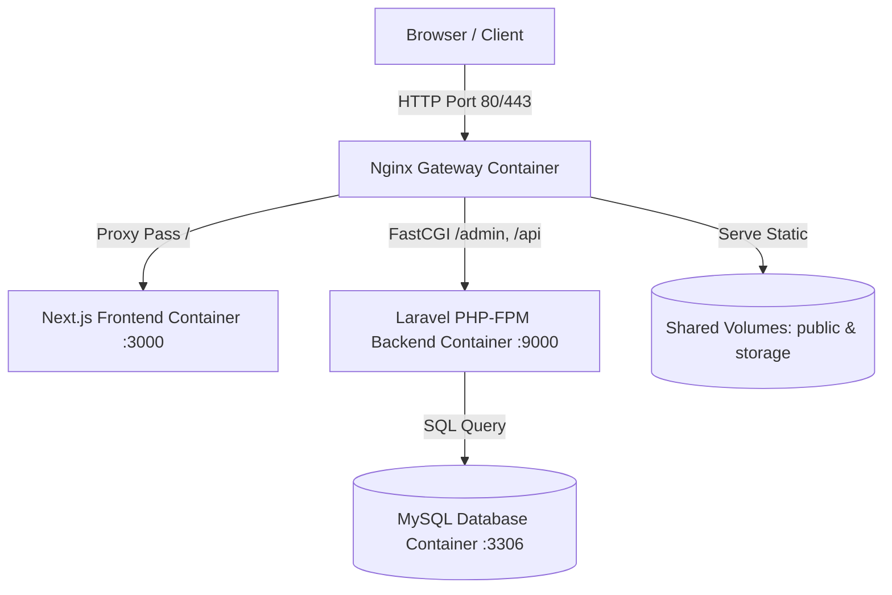

# 🚗 Long Khánh Ford - Monorepo (Next.js + Laravel CMS)

Dự án website chính thức của **Long Khánh Ford**, bao gồm trang giới thiệu sản phẩm & tin tức dành cho khách hàng (Frontend) và hệ quản trị nội dung CMS (Backend) tích hợp chuẩn SEO.

Dự án được tổ chức theo mô hình **Monorepo** được ảo hóa và quản lý bởi **Docker & Nginx Gateway**.

---

## 🏗️ Kiến trúc Hệ thống (Architecture)



*   **Nginx Gateway (Port 80/443)**: Đóng vai trò là reverse proxy duy nhất nhận mọi request từ client:
    *   `/` (Trang chủ, chi tiết xe, tin tức...) -> Chuyển hướng sang Next.js Frontend.
    *   `/admin`, `/api`, `/sanctum`, `/login` -> Chuyển sang Laravel Backend (PHP-FPM).
    *   `/storage`, `/build`, `/assets` -> Nginx tự phục vụ trực tiếp các file tĩnh thông qua ổ đĩa chia sẻ (Shared Volumes) của Docker để tối ưu tốc độ tải trang.
*   **Next.js Frontend**: Đảm nhận phần hiển thị giao diện tối ưu tốc độ, chuẩn SEO và trải nghiệm người dùng (SSR).
*   **Laravel Backend**: Chứa cơ sở dữ liệu và hệ thống Admin Panel quản trị (CMS) xây dựng trên Inertia.js + Vue 3.

---

## 🛠️ Công nghệ Sử dụng (Tech Stack)

*   **Frontend**: Next.js 16+, React 19, Tailwind CSS.
*   **Backend**: Laravel 10+, Inertia.js, Vue 3, PrimeVue, MySQL.
*   **DevOps / Infrastructure**: Docker, Docker Compose, Nginx, Coolify (Production Deployment).

---

## 💻 Hướng dẫn Chạy cục bộ (Local Development)

### Cách 1: Chạy trực tiếp (Không dùng Docker)

#### 1. Khởi chạy Backend (Laravel)
1. Truy cập thư mục backend:
   ```bash
   cd be
   ```
2. Khởi tạo tệp cấu hình `.env` từ file ví dụ:
   ```bash
   cp .env.example .env
   ```
3. Cài đặt các thư viện PHP:
   ```bash
   composer install
   ```
4. Cài đặt các thư viện Javascript & tạo symlink:
   ```bash
   yarn install
   php artisan storage:link
   php artisan key:generate
   ```
5. Chạy migration và seed dữ liệu mẫu:
   ```bash
   php artisan migrate:fresh --seed
   ```
6. Khởi chạy đồng thời Server PHP và Vite biên dịch assets:
   ```bash
   php artisan serve
   yarn dev     # Chạy frontend panel admin
   yarn backend # Chạy backend panel admin
   ```

#### 2. Khởi chạy Frontend (Next.js)
1. Truy cập thư mục frontend:
   ```bash
   cd fe
   ```
2. Cài đặt các thư viện Node.js:
   ```bash
   npm install # Hoặc yarn install
   ```
3. Chạy môi trường phát triển:
   ```bash
   npm run dev
   ```

---

### Cách 2: Chạy toàn bộ hệ thống bằng Docker Compose

Bạn có thể khởi chạy toàn bộ hệ thống (Frontend, Backend, Nginx, MySQL) chỉ với một lệnh duy nhất:
```bash
docker-compose up --build
```
Hệ thống sẽ khả dụng tại địa chỉ: `http://localhost`.

---

## 🚀 Hướng dẫn Triển khai lên Production (Coolify Deployment)

Coolify là nền tảng quản trị VPS tự lưu trữ mạnh mẽ. Nhờ cấu hình Docker Compose chuẩn hóa, bạn có thể deploy dự án lên Coolify dễ dàng theo các bước sau:

### Bước 1: Chuẩn bị trên Git
Đảm bảo toàn bộ mã nguồn của bạn đã được push lên Git repository (GitHub/GitLab).

### Bước 2: Tạo ứng dụng trên Coolify
1. Đăng nhập vào Coolify Dashboard.
2. Chọn **Project** -> **Sources** -> Thêm liên kết tài khoản Git của bạn nếu chưa kết nối.
3. Chọn **Add New Resource** -> **Docker Compose**.
4. Chọn repository chứa dự án và nhánh (`main`/`master`) cần triển khai.
5. Coolify sẽ tự động đọc tệp `docker-compose.yml` ở thư mục gốc của dự án.

### Bước 3: Cấu hình Biến môi trường (Environment Variables)
Tại tab **Environment Variables** của ứng dụng trên Coolify, hãy khai báo các biến môi trường sau để hệ thống chạy chuẩn xác:

| Biến môi trường | Giá trị khuyến nghị | Mô tả |
| :--- | :--- | :--- |
| `APP_ENV` | `production` | Môi trường chạy dự án |
| `APP_DEBUG` | `false` | Tắt chế độ debug hiển thị lỗi bảo mật |
| `APP_KEY` | `base64:xxxx...` | Khóa mã hóa Laravel (Hãy sinh bằng `php artisan key:generate` trên máy cá nhân rồi dán vào) |
| `APP_URL` | `https://longkhanhford.domain.com` | Tên miền chính thức của dự án |
| `NEXT_PUBLIC_API_URL` | `https://longkhanhford.domain.com/api` | Đường dẫn gọi API (Đóng gói vào Next.js lúc build) |
| `PORT_WEBSERVER` | `8080` (Hoặc cổng trống bất kỳ) | Tránh xung đột cổng `80` hệ thống VPS đang chạy Traefik của Coolify |
| `DB_CONNECTION` | `mysql` | Loại cơ sở dữ liệu |
| `DB_HOST` | `db` (Hoặc endpoint DB nếu dùng DB rời) | Tên service database trong docker-compose |
| `DB_PORT` | `3306` | Cổng kết nối DB |
| `DB_DATABASE` | `dnf_db` | Tên cơ sở dữ liệu |
| `DB_USERNAME` | `dnf_user` | Tài khoản kết nối DB |
| `DB_PASSWORD` | `mật_khẩu_bảo_mật` | Mật khẩu kết nối DB |
| `DB_ROOT_PASSWORD` | `mật_khẩu_root_bảo_mật` | Mật khẩu quản trị cao nhất của MySQL |

> [!IMPORTANT]
> Biến `NEXT_PUBLIC_API_URL` bắt buộc phải khai báo chính xác vì Next.js sẽ inlined trực tiếp giá trị này vào file Javascript khi build Docker Image.

### Bước 4: Cấu hình Domain & Port routing trên Coolify
1. Trong giao diện cấu hình ứng dụng trên Coolify, tại phần cấu hình **Domains**:
   * Nhập tên miền của bạn (ví dụ: `https://longkhanhford.domain.com`).
2. Tại phần **Port / Destination Service**:
   * Chọn dịch vụ đích là: `webserver` (Đây là Nginx Gateway container).
   * Điền cổng đích là: `80` (Cổng Nginx lắng nghe bên trong Docker Network).
   * Coolify's Traefik sẽ tự động nhận diện traffic từ cổng `443` (HTTPS) của tên miền bên ngoài và chuyển tiếp về cổng `80` của Nginx Gateway.

### Bước 5: Deploy
1. Click **Deploy**.
2. Quá trình deploy sẽ tự động thực hiện các tác vụ sau:
   * Tải code từ Git về.
   * Xây dựng Next.js frontend ở chế độ `standalone` tối giản dung lượng.
   * Cài đặt composer package backend, sinh routes Ziggy, build UI Admin.
   * **Chạy script entrypoint thông minh**:
     1. Tự động sao chép các assets tĩnh mới nhất vào ổ đĩa chung để Nginx phục vụ.
     2. Tạo liên kết lưu trữ `storage:link` tự động.
     3. Đợi kết nối Database sẵn sàng và tự động chạy `php artisan migrate --force` để cập nhật bảng dữ liệu.
     4. Tối ưu hóa bộ nhớ đệm (Cache config, cache routes, cache views) để tăng tốc độ chạy Laravel.

---

## 🔒 Quản trị và Sao lưu dữ liệu trên Production
*   **Dữ liệu ảnh tải lên**: Được lưu giữ trong Docker Volume `backend-storage` (`/var/www/storage`). Hãy thiết lập sao lưu định kỳ thư mục này trên VPS để tránh mất mát dữ liệu hình ảnh.
*   **Database**: Được lưu giữ trong Docker Volume `db-data` (`/var/lib/mysql`). Bạn có thể sử dụng tính năng backup cơ sở dữ liệu tích hợp sẵn của Coolify hoặc chạy lệnh dump MySQL thông thường.
