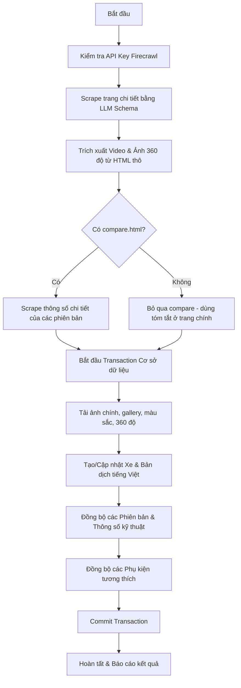

# Kế hoạch Cào dữ liệu Dải Sản Phẩm Ford Việt Nam

Tài liệu này chi tiết hóa kế hoạch, các câu lệnh thực thi, cấu trúc dữ liệu và các lưu ý kỹ thuật để cào dữ liệu toàn bộ dải sản phẩm từ website chính thức Ford Việt Nam (`ford.com.vn`) và đồng bộ hóa vào cơ sở dữ liệu của Laravel CMS.

---

## 1. Danh Sách Sản Phẩm & Ánh Xạ URL

Để đảm bảo cào thành công, các URL của Ford Việt Nam được xác định chính xác như sau:

| Tên Dòng Xe | Phân Khúc / Nhóm Xe | URL Chi Tiết Sản Phẩm | URL Trang So Sánh (Specs) |
| :--- | :--- | :--- | :--- |
| **Ford Everest** | SUV (`suv`) | `https://www.ford.com.vn/showroom/suvs/ford-everest/` | `https://www.ford.com.vn/showroom/suvs/ford-everest/compare.html` |
| **Ford Territory** | SUV (`suv`) | `https://www.ford.com.vn/showroom/suvs/ford-territory/` | `https://www.ford.com.vn/showroom/suvs/ford-territory/compare.html` |
| **Ford Explorer** | SUV (`suv`) | `https://www.ford.com.vn/suvs/explorer/` | *Không có (Chỉ có 1 phiên bản)* |
| **Ford Ranger** | Bán tải (`ban-tai`) | `https://www.ford.com.vn/showroom/trucks/ford-ranger/` | `https://www.ford.com.vn/showroom/trucks/ford-ranger/compare.html` |
| **Ford Ranger Raptor** | Bán tải (`ban-tai`) | `https://www.ford.com.vn/showroom/trucks/ford-ranger-raptor/` | *Không có (Chỉ có 1 phiên bản)* |
| **Ford Transit** | Thương mại (`thuong-mai`) | `https://www.ford.com.vn/showroom/trucks/ford-transit/` | `https://www.ford.com.vn/showroom/trucks/ford-transit/compare.html` |

---

## 2. Kiến Trúc & Quy Trình Crawl & Sync

Hệ thống crawl được xây dựng thông qua Command Line: `php artisan vehicle:crawl-ford` tích hợp với `FirecrawlService` để xử lý.



### Các bước hoạt động chính:
1. **Trích xuất bằng LLM (Firecrawl API):** Gửi yêu cầu với JSON Schema tới Firecrawl để lấy các thông tin: Tên xe, Tagline, Mô tả, Giá cơ bản, màu sắc (gồm tên, mã hex, ảnh xe), các phiên bản (gồm tên, giá bán, thông số cơ bản) và các phụ kiện chính hãng.
2. **Cào thông số chi tiết (Compare Specs):** Trích xuất thông số kỹ thuật dạng bảng (Category -> Key -> Value) từ trang so sánh của xe.
3. **Trích xuất Media nâng cao (Raw HTML Parser):** Tự động phân tích HTML trang nguồn để tìm video Youtube/MP4 và các mẫu ảnh 360 độ.
4. **Mở rộng ảnh 360 độ (Sequence Expansion):** Phát hiện tên file dạng chuỗi (ví dụ: `01.webp`, `02.webp`,... `36.webp`) và mở rộng để tải về đầy đủ 36 khung hình xoay ngoại thất và nội thất.
5. **Đồng bộ cơ sở dữ liệu:** Ghi dữ liệu dạng Transaction, tự động tải và lưu trữ hình ảnh vào thư mục `public/storage/uploads/` nhằm tối ưu tốc độ tải trang nội bộ và chuẩn SEO.

---

## 3. Danh Sách Câu Lệnh Thực Thi

Khi triển khai thực tế, quản trị viên sẽ chạy các câu lệnh dưới đây lần lượt trong terminal của thư mục backend (`be/`):

### 1. Đồng bộ nhóm xe SUV
```bash
# 1. Ford Everest
php artisan vehicle:crawl-ford https://www.ford.com.vn/showroom/suvs/ford-everest/ --category_id=1

# 2. Ford Territory
php artisan vehicle:crawl-ford https://www.ford.com.vn/showroom/suvs/ford-territory/ --category_id=1

# 3. Ford Explorer
php artisan vehicle:crawl-ford https://www.ford.com.vn/suvs/explorer/ --category_id=1
```

### 2. Đồng bộ nhóm xe Bán tải
```bash
# 4. Ford Ranger
php artisan vehicle:crawl-ford https://www.ford.com.vn/showroom/trucks/ford-ranger/ --category_id=2

# 5. Ford Ranger Raptor
php artisan vehicle:crawl-ford https://www.ford.com.vn/showroom/trucks/ford-ranger-raptor/ --category_id=2
```

### 3. Đồng bộ nhóm xe Thương mại
```bash
# 6. Ford Transit
php artisan vehicle:crawl-ford https://www.ford.com.vn/showroom/trucks/ford-transit/ --category_id=3
```

> [!NOTE]
> Các ID phân khúc xe (`--category_id`) mặc định lần lượt là: `1` cho SUV, `2` cho Bán tải, và `3` cho Thương mại. Bạn có thể kiểm tra chính xác ID phân khúc trong bảng `vehicle_categories` trước khi chạy.

---

## 4. Cấu Trúc Lưu Trữ Hình Ảnh (Storage Structure)

Mọi tệp hình ảnh được tải về sẽ tự động chuyển đổi tên thành dạng slug an toàn và lưu trữ trong thư mục `storage/app/public/uploads/` (được liên kết tới `public/storage/uploads/`):

*   **Ảnh chính & Gallery xe:** `vehicles/{vehicle-slug}/` và `vehicles/{vehicle-slug}/gallery/`
*   **Ảnh phiên bản:** `vehicles/{vehicle-slug}/versions/`
*   **Ảnh màu sắc:** `vehicles/{vehicle-slug}/colors/`
*   **Ảnh xoay 360 độ (Ngoại thất):** `vehicles/360/{vehicle-slug}/{color-slug}/exterior/`
*   **Ảnh xoay 360 độ (Noi thất):** `vehicles/360/{vehicle-slug}/{color-slug}/interior/`
*   **Ảnh phụ kiện:** `accessories/`

---

## 5. Xử Lý Các Trường Hợp Đặc Biệt & Lỗi Thường Gặp (Edge Cases)

Trong quá trình cào, một số lỗi biên có thể xuất hiện và đã được thiết lập phương án giải quyết trong mã nguồn:

1. **Chặn tải ảnh từ Ford CDN:** Máy chủ CDN của Ford có cơ chế chống cào quét bằng cách chặn các request không có header hợp lệ.
   - *Giải pháp:* Command đã tích hợp gửi request giả lập trình duyệt có User-Agent và Referer (`https://www.ford.com.vn/`) khi tải ảnh.
2. **Không có trang so sánh (compare.html):** Các xe chỉ có một phiên bản như Explorer hay Raptor sẽ không có trang so sánh.
   - *Giải pháp:* Command tự động bắt lỗi HTTP 404 của trang compare và tiếp tục thực hiện đồng bộ với các thông số tóm tắt lấy được từ trang chính.
3. **Màu sắc không khớp tên:**
   - *Giải pháp:* Hệ thống sử dụng bảng ánh xạ màu sắc Tiếng Việt sang Tiếng Anh (ví dụ: `Trắng Tuyết` -> `snowflake-white`) để sinh URL phỏng đoán ảnh 360 độ. Nếu phát hiện thấy URL hoạt động (HTTP 200), hệ thống sẽ tự động tải trọn bộ 36 ảnh của màu đó.
4. **Quá giới hạn Firecrawl API (Quota Limit/Timeout):**
   - *Giải pháp:* Thiết lập timeout kết nối tối đa 120 giây. Nếu Firecrawl bị lỗi hoặc hết lượt dùng, command sẽ ghi nhận log lỗi chi tiết vào `storage/logs/laravel-YYYY-MM-DD.log`.

---

## 6. Kế Hoạch Xác Minh (Verification Plan)

Sau khi chạy các câu lệnh cào, thực hiện xác minh theo các bước sau:

### Bước 1: Kiểm tra CSDL (Database Check)
Chạy lệnh tinker kiểm tra số lượng bản ghi xe đã được đồng bộ:
```bash
php artisan tinker --execute="print_r([
    'total_vehicles' => App\Models\Vehicle\Vehicle::count(),
    'versions_count' => App\Models\Vehicle\VehicleVersion::count(),
    'accessories_count' => App\Models\Vehicle\Accessory::count(),
])"
```

### Bước 2: Kiểm tra Filesystem
Kiểm tra xem các thư mục ảnh 360 độ và ảnh xe đã được tải về đầy đủ chưa:
```bash
ls -la public/storage/uploads/vehicles/
ls -la public/storage/uploads/vehicles/360/
```

### Bước 3: Kiểm tra Giao diện hiển thị (Frontend Check)
1. Truy cập trang chi tiết xe trên Frontend (Next.js) ví dụ: `http://localhost/san-pham/ford-everest`.
2. Kiểm tra hiển thị của Banner, Giá bán, Mô tả và Thông số kỹ thuật.
3. Thử nghiệm bộ xoay 360 độ ngoại thất và nội thất xem ảnh có bị giật hay mất khung hình không.
